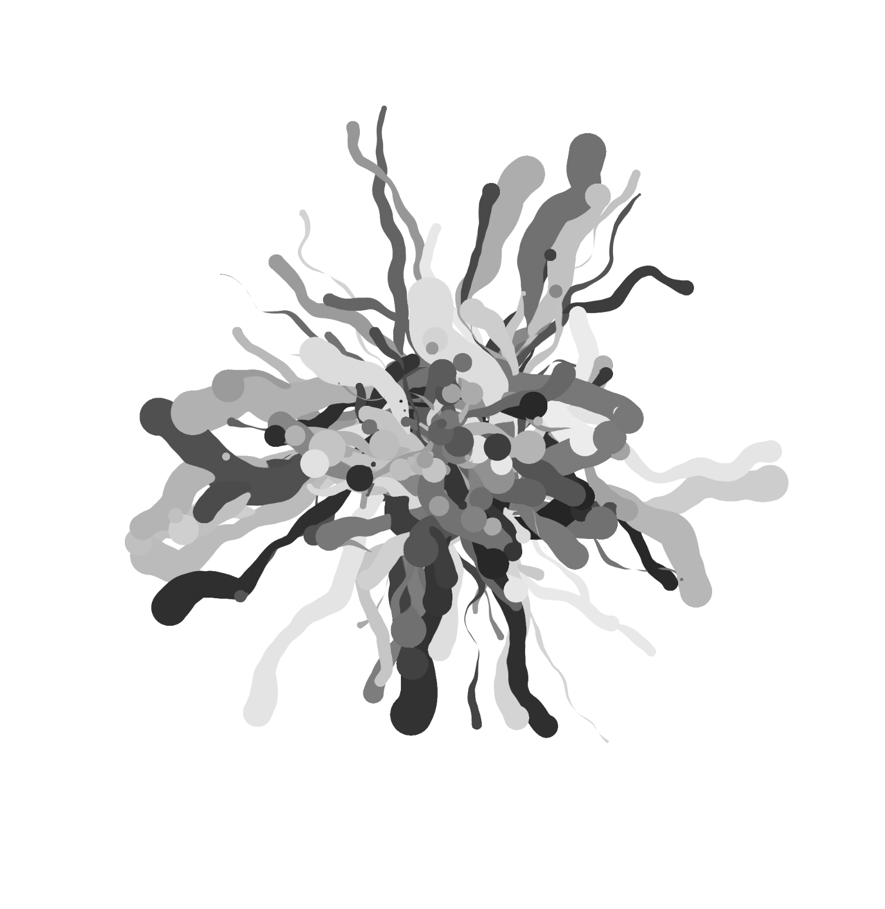

# Swirls (for Lukas)

https://muffinman.io/generative-swirls/

Simple generative swirls in p5. It started as <a href="https://www.instagram.com/p/CAtFiqjHVqn/">a simple exploration</a>, which I lost code for. But my friend really liked it, so I went back and recreated it for him to play with.

[](https://muffinman.io/generative-swirls)

Code is super messy, but I don't really care, as the final product are the images and not the code.

Project depends on this repo https://github.com/Stanko/generative-utils

So if you want to run it locally, you'll have to clone that repo as well:

```
git clone git@github.com:Stanko/generative-swirls.git
git clone git@github.com:Stanko/generative-utils.git

cd generative-swirls

npm install
npm start
```

And you should be able to see it locally on http://localhost:1234
